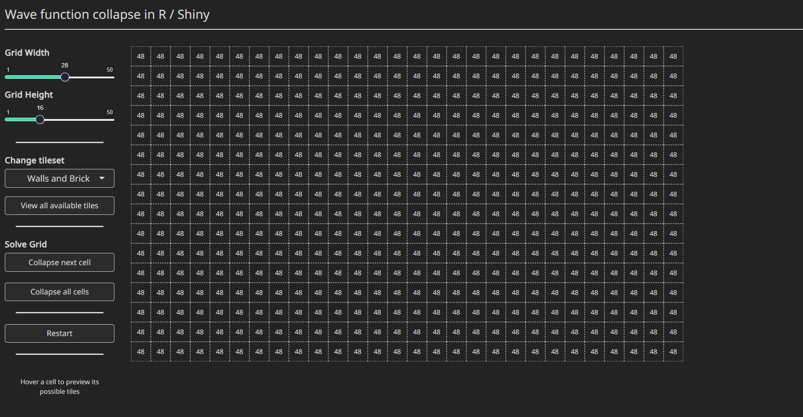
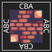

# rwfc
A (very much work in progress) implementation of the Wavefunction Collapse Algorithm for procedural generation in R.



You can play around with a demo here keep in mind large grids do take longer to solve:
- Demo: https://sparktuga.shinyapps.io/shinywfc/

# Usage
1 - Install the package:

from github:
```R
devtools::install_github('pedrocoutinhosilva/rwfc')
```

2 - Include the library into your project:
```R
# global.R
library(rwfc)
```

3 - Create a set of tiles that you would like to use. Each tile should contain some data and a set of "keys" that represent each of the sides of the tile. These keys can be any string of numbers of characters, starting with the `up` side.

Its important to note that keys should be written as if going clockwise around the tile, not simply left to right.

Take for example the following tile:



Each letter represents a material in the tile, A for wall, B for brick and C for space. This makes the top socket CBA and the right socket ABC, since we are moving around the tile clockwise and adding letters as the materials appear.

This is important since when tiles connect, they sockets need to be "mirrored" to actually fit.

You can create tiles with the `wfc_tile` function:
```R
wfc_tile("tile035", c("ABA", "ABA", "ABA", "ABA"))
```

If your tile can be rotated, you can include the data for each 45deg rotation as part of a third argument:
```R
wfc_tile("tile020", c("AAA", "ABC", "CBA", "AAA"), c("tile022", "tile060", "tile058"))
```

4 - After defining your tiles, you can then initiaize a object that will handle the generation of the final tiled grid:

```R
final_grid <- wfc_grid(width, height, tiles)
```

5 - You can trigger the generation of the tiled grid step by step of all at once:
```R
# Calculate the next tile
final_grid$step()

# Calculate the final grid
final_grid$solve()
```
At an point you can use the `wfc_grid` object to access its state:
```R
state <- final_grid$get_grid()

cell <- state$[[target_column]][[target_row]]

cell$get_possible_tiles() #return the current tiles that cell can be

tile <- cell$get_possible_tiles()[[1]] # if only one tile exists,
tile$get_data() # we can retrieve the data from that tile and know the value of a cell in the grid
```

6 - You can reset the grid and start a new generation by resetting the grid object
```R
final_grid$reset()
```


---

# TODO
Code is still a mess and in dire need of documentation.

Currently only a simple tile model is implememented, processing images into tiles might come soon (tm) in the future.

Implementing the generation of tiles directly from a image as in the original implementation. For its mostly fun with premade tiles.


# References
- The original Wavefunction collapse implementation (C#): https://github.com/mxgmn/WaveFunctionCollapse
- A great read explaining the algorith in detail: https://robertheaton.com/2018/12/17/wavefunction-collapse-algorithm/